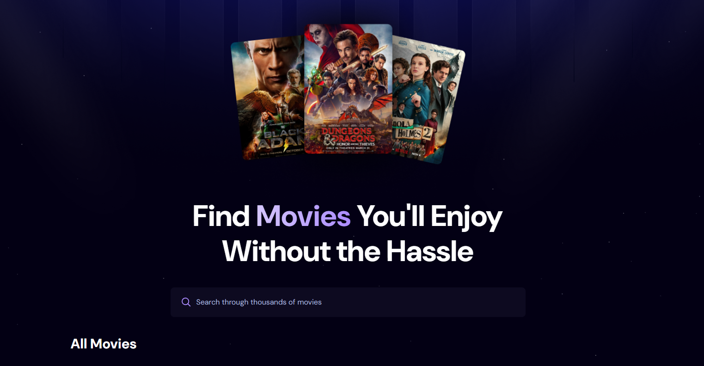

# 🎬 Go Movies

Go Movies is a modern web application built with React that allows users to search and browse movies using The Movie Database (TMDB) API. It features a responsive UI, search with debounce, smooth pagination, and elegant loading and error states.

🔗 **Live Demo:** [go-movies-chi.vercel.app](https://go-movies-chi.vercel.app/)

## 🚀 Features

- 🔍 **Search Movies** in real-time with debounce to minimize API calls
- 📄 **Pagination** to browse through pages of results
- 🎨 **Stylish UI** with Tailwind CSS and gradient buttons
- ⚙️ **API Integration** with TMDb for real-time movie data
- 📱 Fully **responsive layout** across devices

## 🖼 Preview

## 🛠 Tech Stack

- React (Vite)
- Tailwind CSS
- TMDb API
- react-use (for debounce)
